# Developer notes on different processes and procedures we used

## Setting up the software

* Unreal Engine 5.3 was used to build and manage the simulation. Unreal was chosen because some group members were familiar with it and because its capabilities should be sufficient for this project. The abundance of community support also made it ideal as we figured out how to use it and for troubleshooting.
  * Update (5/14): We updated it to Unreal 5.4 due to issues we were having with building it
* We followed the startup tutorial [here](https://dev.epicgames.com/community/learning/tutorials/3Vx6/unreal-engine-5-3-2-for-meta-quest-vr) to download and set up all the other necessary software, plug-ins, and settings. Note that the Meta XR plug-in, which has some vr specific tools, is needed to play or preview the simulation on the laptop but is not necessary if exporting the simulation to the quest. 

## Set up and recording 360 videos

### Setting up the camera to record

* Insta360 Pro 2 was used to film, stabilized using the provided tripod
* We used Farsight with the transmitter, receiver, and one of our phones to control and monitor the recording.

1. Make sure you have the 360 camera, SD cards, antennas, receiver, tripod, and battery, and that they are all fully charged.  
   [Picture of equipment](development_notes_images/equipment.jpg)
2. Attach the antennas to the top of the 360 camera, making sure the AP antenna is attached to the AP spot and GPS antenna to the GPS slot.  
   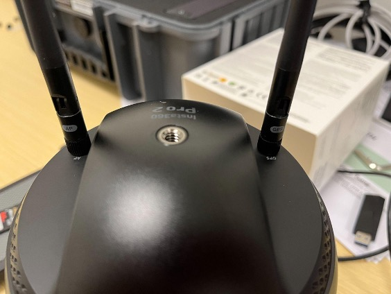
3. Insert all 6 micro SD cards into the camera. The order of the placement does not matter.  
   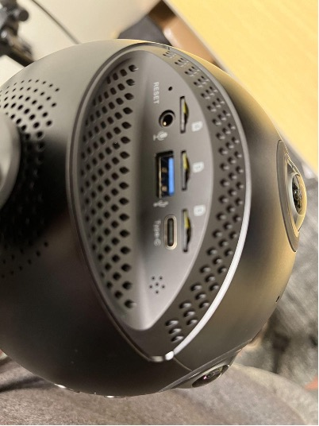
4. Attach the camera to the tripod but do not plug in the ethernet cord yet.  
   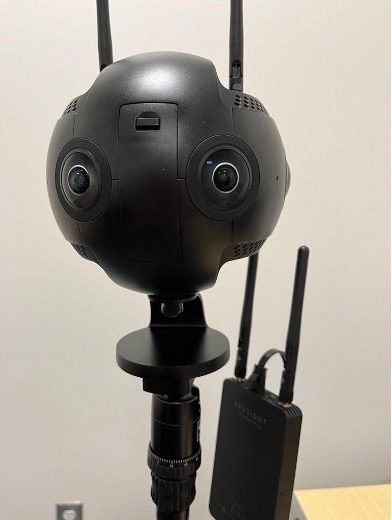
5. Insert the camera battery into the battery slot, but do not insert the main SD card yet.  
   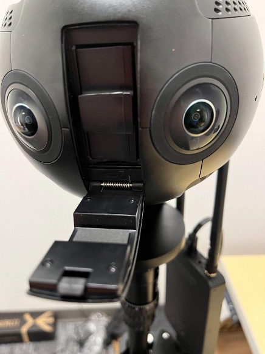
6. Hold the circle button until the camera starts. Do not touch anything until the screen looks like the picture.
7. Once the screen looks like the picture, now you can insert the SD card. **Note: the camera must be fully powered on before inserting the SD card and fully powered off before removing the card.**  
   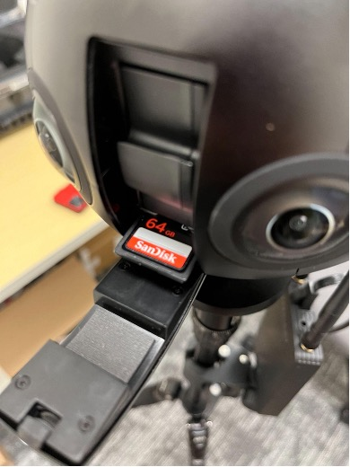
8. Turn on the transmitter on the tripod until the green lights are stable.  
   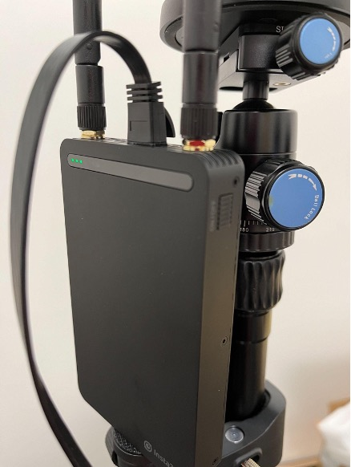
9.  In the settings, make sure the ethernet is on DHCP, then plug the ethernet into the camera.  
    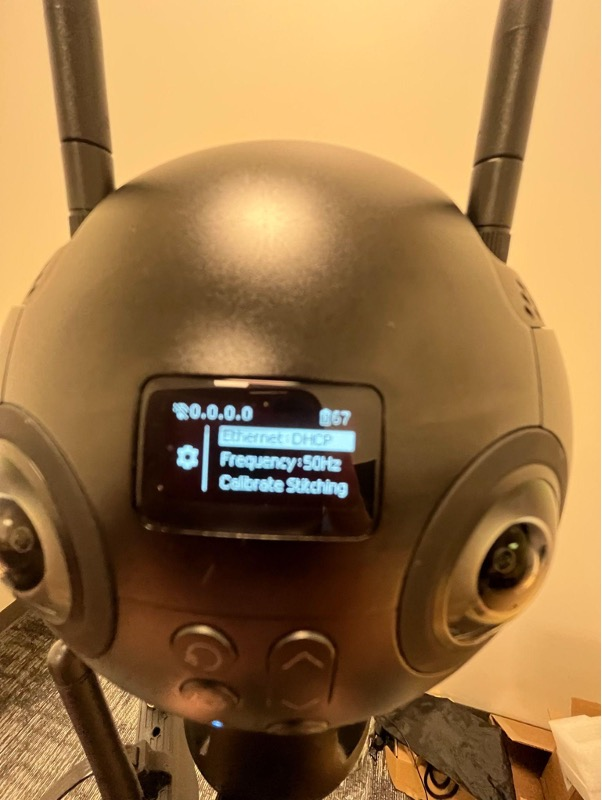
10. If it is working properly, at the top of the screen you should see 192.186.100.117.
    * If you do not see that, unplug the transmitter and repeat steps 8-10 to reset the ethernet settings.  
    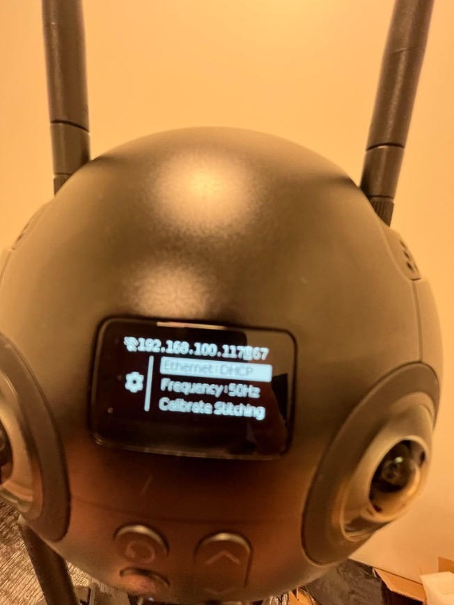
1.  Next, insert a phone into the receiver device. Make sure the phone has wifi turned on and the Insta360Pro app downloaded.
2.  In the Insta360Pro app, input the ethernet code from earlier and connect the device. You should see 4 blue dots if it is connected right. If not, reset and turn it on/off again.  
3. 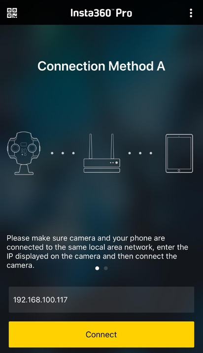
4.  Now, you are set to start filming or taking photos.  
   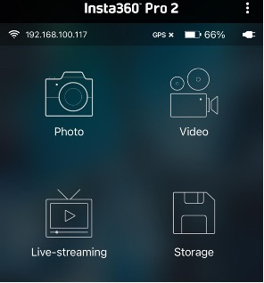

### Filming process

1. Filming is fairly straight forward using the film option. Settings can be changed when you open the app. So far, the settings we've used are:
   * Mode Normal
   * Content360 3D
   * Real-time falsse
   * Resolution 8k
   * I-log false
   * Grain 0
2. Hit the red button to start filming.  
   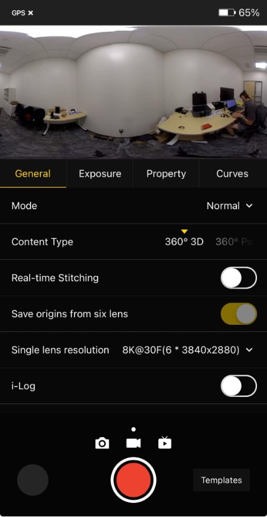
3. After you're done filming, follow the steps in the "Uploading and processing videos" section below.

## Uploading and processing videos

### How to upload videos to the laptop

1. After the camera is fully shut down, take out all 6 nano SSD cards and the main SSD card and insert them into the USBs. Then, insert the USBs into the USB bus to upload and process on the laptop.  
   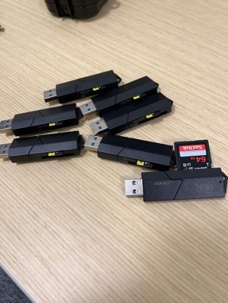 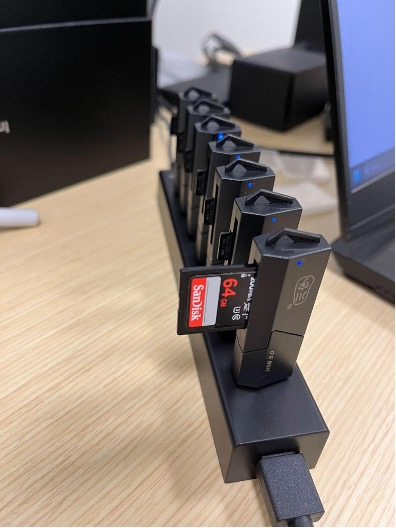
2. From the main SSD, copy all the videos from the recording session into another folder on the laptop (let's call this folder `Copy`).
   * There needs to be 3 types of files, `origin_#_irv`, `preview`, and `pro.prj`
3. The nano SSDs files are called `origin_#`. From each of the 6 nano SSD files, copy `origin_#` video from the corresponding recording session to the `Copy` folder.
4. Note: If you use the auto-stitching, you'll end up with 4 files called `audio`, `3d`, `preview`, `pro.prj` at step 2. Then, do step 3 and continue on.
5. Clear the SSD cards after copying them to the laptop, to reduce clutter on the cards.

### How to process the videos to use

1. Open Insta360 stitcher (app already installed on the laptop).
2. Adjust the settings as pictured 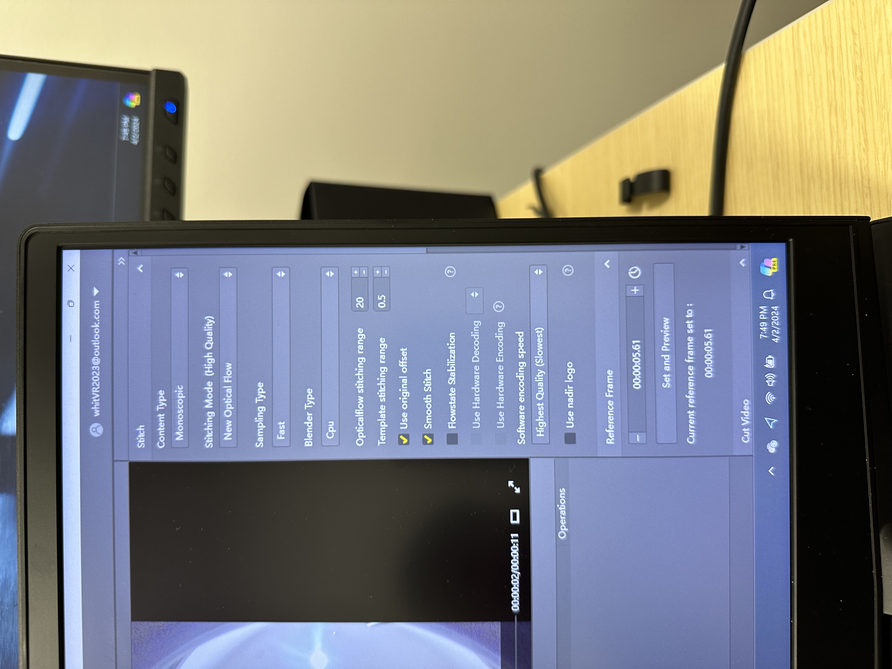
3. If you're only editing one video, you can hit "stitch now". Or, you can select "add to batch list" to stitch all at once later.
4.  Once the video is done stitching, you will have a 360 video that can now be used in Unreal.

## Getting the 360 video into Unreal and Quest Pro

* We followed this [Tutorial](https://www.youtube.com/watch?v=l3fp9uhNc-M).
This Tutorial is a great starting place when just opening unreal, Goes over the basics of importing and getting a 360 mp4 to play in unreal, there is a ton of formatting information but most of it is very important in increasing the quality of our videos. Secondly, the video briefly goes over an extremely simple UI in the form of a play button. The entire process is great information for setting up buttons and interactive elements for adequate testing. Important to note Unreal has a much easier time with video resolutions that are a power of two, We are currently using (4096x2048) for this reason.

* Important Note at Time Stamp 20:20, In all the video's material graph you can drag the RGB node from the 'texture sample' directly to the videos 'final color' node. We essentially skip the 'Power(X,2)' card as this is the setting that has been unknowingly been darkening our videos. When done the is no need to edit in Premier Pro.

* Video Editing was once done briefly in Adobe Premiere, primarily just to adjust the resolution, and to lighten the videos. However, we have since found that everything we need to edit can be done in Unreal Engine.
* The Old Adobe Premiere Pro Video Editing Instructions:
  - Open Adobe Premiere (Potentially Free Access in Lied Art Center), start a new project and drag and drop the desired video clip to be edited into the program.
  - After getting your video in, you need to drag the sequence into the timeline, this should initiate a preview window, it is best to keep your interaction with the preview to a minimum as later it will start buffering becoming very slow and wasting time.
  - To edit resolution you need to find the 'sequence settings' menu by left clicking on the name of your sequence to open up a menu with the option in it. More generally find the thumbnail for your video and right under the picture, right click the label text, it should be directly under the thumbnail for you video.
  - To add effects ensure that the "effect" panel and the "effect control" panel are visible, if not, enable them under the 'view' drop down menu, it is accessed close to the top left of the screen.
  - Drag desired editing effects from the effect list directly onto your video in the timeline you can search for specific ones. The effects we have been using is 'lighting' (used to brighten the video) and 'VR Projection' (Used to fix the seam created from changing resolution).
  - Now in the effect control panel expand 'lighting', then expand 'light 1', then click the 'light type' dropdown and select 'directional' this is the best way we found to brighten videos without washing them out.
  - All that is left is to export, go to 'file' then 'export'

## Facial Detection Database

We downloaded and used the Unconstrained Facial Detection Dataset (UFDD).
Found here: https://drive.google.com/drive/folders/13HMDDhq-hglX3k6UdIU967_e75k68Lk1

## Neural Network Information

The facial detection neural network is built off of the keras and tensorflow libraries. After running 'train_model.py', it will save a file 'face_detection.keras'. Note that training a neural network takes a long time, and should only be done if you change the structure! You can load the model after training and use it to predict whether or not an image contains a face via:

```
from keras.models import load_model
import keras
import numpy as np

model = load_model('face_detection.keras')

img = keras.utils.load_img('path/to/img.jpg', target_size= image_size)
x = keras.utils.img_to_array(img)
x = np.expand_dims(x, axis= 0)

predictions = model.predict(x)

score = float(keras.activations.sigmoid(predictions[0][0]))
print(f"This image is {100 * (1 - score):.2f}% distractor and {100 * score:.2f}% face.")
```

`batch_size` here should match `batch_size` in 'train_model.py', and `image_size` here should be an identical tuple to `image_size` in 'train_model.py'.

## Future developments ideas/notes

This will be a running list of ideas or notes for future development and work that come up as we approach the end of our project timeline.

Last updated: 5/16/24

* **Method for option selection:** The next goal is to take away the multiple choice selection where the user has to click their choice (since it's unnatural/not realistic) - so voice or action would be what the user uses to make choices
  * For example, if the user looks at the lunch line staff for X seconds, then the lunch line staff will begin talking
  * This would require learning/finding out how to incorporate voice as an input
* **Classification model:** incorporate the neural network model into the simulation so that it can detect whether a user is looking at a person, an object, etc. 
  * Look into whether ML can be used for voice/tone identification too - such as if a user spoke too softly or loudly, etc
* **Data presentation:** develop a dynamic replay of the user's simulation with data incorporated
  * Such as whether eye contact was made and for how long, where was the user looking, volume user spoke at, user's facial expressions, etc.
* **Computer Vision - Tracking Movement:** here are two open source options that look promising in gathering more data from the simulation.
* OpenCV: https://opencv.org/
Purpose: OpenCV (Open Source Computer Vision Library) is a versatile library primarily used for computer vision tasks, including image and video processing, object detection, and tracking.
Features:
General Purpose: OpenCV is not specifically designed for facial expression or body motion tracking, but it provides a wide range of tools for various computer vision tasks.
Facial Expression: While OpenCV doesn’t have built-in facial expression tracking, you can use its features (such as face detection and landmark detection) to build custom solutions.
Body Motion: OpenCV offers tools for basic body pose estimation, but it’s not as specialized as OpenPose.

* OpenPose: https://github.com/CMU-Perceptual-Computing-Lab/openpose
Purpose: OpenPose is specifically designed for human pose estimation, including body, hand, and facial keypoints.
Features:
Body Motion: OpenPose excels in full-body pose estimation, tracking multiple body joints and their movements.
Facial Expression: It also provides facial landmark detection, which can be used for tracking expressions.
Real-Time: OpenPose works in real-time and post-processing modes.
Multi-Person: It can handle multiple people simultaneously.